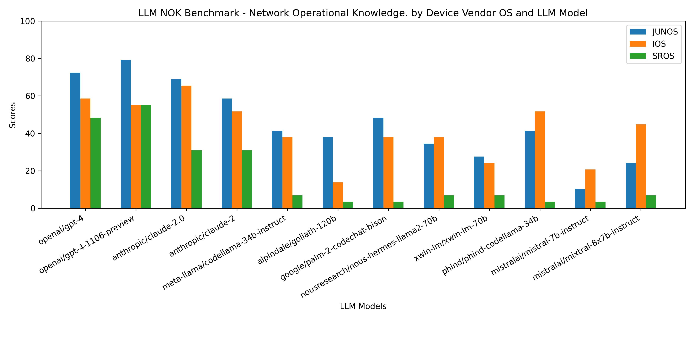

# llm-nok-benchmark
# Network Operational Knowledge (NOK) benchmarking for LLMs.

This repository contains the archives to run the Industry's first benchmark intended to evaluate Large Language Models (LLMs) in different network related tasks. 

In this first iteration, the focus is in Network Operational Knowledge (NOK)

The goal is to evaluate how good or bad an LLM is in generating the proper operational CLI commands for different networking vendor operating systems. A high mark in this benchmark sets this LLM in a good position to be used in automation related tasks for such vendor. 

Over time more dimensions will be added to the benchmark such as:
- Configuration command generation.
- Analysis of operational data

## Instructions

- Clone or download the current repository in your laptop or server.

- Create a virtual environment with the right libraries contained in the `requirements.txt` file

- Start the new virtual environment

- Create a `.env` file in the directory that contains the following environmental variables:

```
    OPENAI_KEY=<your OpenAI API key>
    OPENROUTER_KEY=<your OpenRouter.ai API key>   

```
NOTE: The benchmark requires both an OpenRouter.ai account and an OpenAI account. The OpenRouter API is used to evaluate multiple LLMs. The LLMs specified in the `llm_under_test_csv` are expressed in the format that OpenRouter specifies. OpenAI API is used for questions evaluation using GPT-4-Turbo, which is so far the most powerful and fast providing a responses.


- Run the benchmark script `nok_benchmark.py`. It supports the following parameters

    --benchmark  : If not specified it will point to the `./benchmarks/benchmark.xlsx` file. If a different file is specified it must follow the same format as the default.

    --llms: If not specified it will use the `./llm_under_test_csv` file. If specified it must be a text file with the models to be tested in different rows, each model out of those supported by OpenRouter.ai

    --vendors: If not specified it will use `./vendor_os_list.csv` file. If specified it must be a text file with the vendor OS names to be evaluated in different rows. Each Vendor OS name must match with the corresponding column in the benchmark xls file.

    --output: The script will generate a .txt file with the summary of the results. By default the file generated will be named `benchmark_results.txt`. A different file name can be specified using this argument


```
(benchmk) (base) javier@Javiers-MBP LLMBenchmark % python nok_benchmark_p.py --llms llm_test.csv    
............................................................................................................................................................................
==========================================

Evaluating vendor OS:  JUNOS
----------------------
Evaluating LLM model:  openai/gpt-4-1106-preview
     Benchmark result: 79.3103448275862
----------------------
----------------------
Evaluating LLM model:  anthropic/claude-2
     Benchmark result: 65.51724137931035
----------------------

==========================================

Evaluating vendor OS:  IOS
----------------------
Evaluating LLM model:  openai/gpt-4-1106-preview
     Benchmark result: 68.96551724137932
----------------------
----------------------
Evaluating LLM model:  anthropic/claude-2
     Benchmark result: 62.06896551724138
----------------------

==========================================

Evaluating vendor OS:  juniper_junos
----------------------
Evaluating LLM model:  openai/gpt-4-1106-preview
     Benchmark result: 79.3103448275862
----------------------
----------------------
Evaluating LLM model:  anthropic/claude-2
     Benchmark result: 65.51724137931035
----------------------
(benchmk) (base) javier@Javiers-MBP LLMBenchmark % 

```

Note: while the execution of the different tests is parallelized, it still takes some time to complete. Somewhere in the order of 2-3 minutes per vendor OS + LLM combination. 

Note: LLM APIs sometimes fail, servers may be overloaded, gateways fail, etc. The execution of a full benchmark implies a large number of LLM API calls. You may observe some errors, but the process will continue and those benchmark questions where it failed will be considered a bad response. Example execution:

```
(benchmk) (base) javier@Javiers-MBP LLMBenchmark % python nok_benchmark_p.py
.............................................................................OpenAI API returned an API Error: HTTP code 502 from API (<html>
<head><title>502 Bad Gateway</title></head>
<body>
<center><h1>502 Bad Gateway</h1></center>
<hr><center>cloudflare</center>
</body>
</html>
)
.............................................................................................................................................................................................................................................................................................................................................................................................An unexpected error occurred
................................................................................An unexpected error occurred
An unexpected error occurred
....................................................................
==========================================

Evaluating vendor OS:  JUNOS
----------------------
Evaluating LLM model:  openai/gpt-4
     Benchmark result: 72.41379310344827
----------------------
----------------------
Evaluating LLM model:  openai/gpt-4-1106-preview
     Benchmark result: 82.75862068965517
----------------------
----------------------
Evaluating LLM model:  anthropic/claude-2.0
     Benchmark result: 72.41379310344827
----------------------
----------------------
Evaluating LLM model:  anthropic/claude-2
     Benchmark result: 65.51724137931035
----------------------
----------------------
Evaluating LLM model:  meta-llama/codellama-34b-instruct
     Benchmark result: 41.37931034482759
----------------------
----------------------
Evaluating LLM model:  alpindale/goliath-120b
     Benchmark result: 37.93103448275862
----------------------
----------------------
Evaluating LLM model:  google/palm-2-codechat-bison
     Benchmark result: 31.03448275862069
----------------------
----------------------
Evaluating LLM model:  nousresearch/nous-hermes-llama2-70b
     Benchmark result: 24.137931034482758
----------------------
----------------------
Evaluating LLM model:  xwin-lm/xwin-lm-70b
     Benchmark result: 27.586206896551722
----------------------
----------------------
Evaluating LLM model:  phind/phind-codellama-34b
     Benchmark result: 44.827586206896555
----------------------
----------------------
Evaluating LLM model:  mistralai/mistral-7b-instruct
     Benchmark result: 17.24137931034483
----------------------

==========================================

Evaluating vendor OS:  IOS
----------------------
Evaluating LLM model:  openai/gpt-4
     Benchmark result: 58.620689655172406
----------------------
----------------------
Evaluating LLM model:  openai/gpt-4-1106-preview
     Benchmark result: 65.51724137931035
----------------------
----------------------
Evaluating LLM model:  anthropic/claude-2.0
     Benchmark result: 65.51724137931035
----------------------
----------------------
Evaluating LLM model:  anthropic/claude-2
     Benchmark result: 55.172413793103445
----------------------
----------------------
Evaluating LLM model:  meta-llama/codellama-34b-instruct
     Benchmark result: 37.93103448275862
----------------------
----------------------
Evaluating LLM model:  alpindale/goliath-120b
     Benchmark result: 24.137931034482758
----------------------
----------------------
Evaluating LLM model:  google/palm-2-codechat-bison
     Benchmark result: 20.689655172413794
----------------------
----------------------
Evaluating LLM model:  nousresearch/nous-hermes-llama2-70b
     Benchmark result: 44.827586206896555
----------------------
----------------------
Evaluating LLM model:  xwin-lm/xwin-lm-70b
     Benchmark result: 31.03448275862069
----------------------
----------------------
Evaluating LLM model:  phind/phind-codellama-34b
     Benchmark result: 44.827586206896555
----------------------
----------------------
Evaluating LLM model:  mistralai/mistral-7b-instruct
     Benchmark result: 17.24137931034483
----------------------

```

## Latest results



You can find the details in the file `benchmark_results.txt`


## Contributing

If you want to contribute to the benchmark in some way pls reach out.

Contact:

javier@anetta.ai

@anettaAI

Ways in which the Benchmark could be improved:

- Add new vendors
- Add new questions
- Build domain specific sets of questions (core specific, BGP specific, Data Center specific, etc)
- Improve the code itself, make it more efficient, faster.
- Add option for local or pluggable LLM endpoints.
- Add knowledge evaluation for configuration, operational data analysis, reasoning, etc.


    